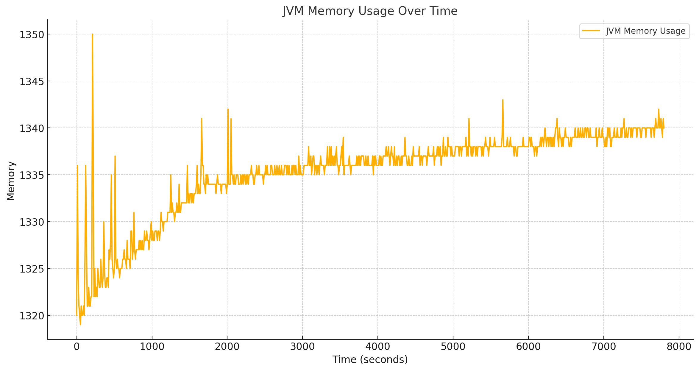

# WhisperJET


FAST Offline Speech Recognition with
One of the fastest Whisper implementation that works flawlessly real-time 
cross platform with JAVA.
It works on 
Linux , Windows , OSX , Android even on IOS ( LibGDX ROBOVM near future )
Its model is far more optimized.


The quality may be increased with a cost of losing performance.
We will update for that.

The library works on Java 8 , 9 , 11 , 19 , 21 , 24+

This is the best Java Whisper Library on the internet.
Dont lose time for Whisper JNI implementations
Dont try to search more and its completely FREE

It can supports **CUDA,FAST CPU,AMD ROCM,INTEL** 
Its ram consumption for X86 is just 1.5GB MAX on JVM !!!


We tried to minimize garbage collection usage as far as we can.
We will upgrade this library more as soon as we have time more.



We will try to support library as possible to make more usable for Java.
<video src="dukeFly.mp4" width="320" height="240" allow="accelerometer; autoplay; clipboard-write; encrypted-media; gyroscope; picture-in-picture"></video>

TESTING :
For Windows UTF-8 CMD: <br>
<code>chcp 65001</code><br>
<br>
<br>
WINDOWS AND OTHERS:<br>
<code>git clone https://github.com/eix128/WhisperJET</code><br>
<code>cd WhisperJET</code><br>
<code>mvn package</code><br>
<code>cd target</code><br>
<code>mkdir models</code><br>
<code>copy ..\src\main\resources\models\*.* models\</code><br>
<code>mkdir testWavs</code><br>
<code>copy ..\src\main\resources\testWavs\*.* testWavs\</code><br>
<code>java -jar WhisperJET-1.0-jar-with-dependencies.jar</code>


USE OF LIBRARY :<br>
<code>git clone https://github.com/eix128/WhisperJET</code><br>
<code>cd WhisperJET</code><br>
<code>mvn install</code><br>
<code>copy models folders from : src\main\resources to your project<br>


You can checkout for codes :

Simple wav for 30 second test
```
    WhisperJET recognizerJava = new WhisperJET();
    byte[] bytes = Main.readWavNClipMax30("testwav.wav");
    long preCheckTime = System.currentTimeMillis();
    String translatedText = recognizerJava.recognize(bytes , languageCode );
```


We will add realtime examples and support also.
Stay tuned!


Reference Works :
https://github.com/niedev/RTranslator


Feel free to ask any questions :<br>
**kadir.bayner@gmail.com**


**Donate By BTC Address :
1KuREYKb1fnnVJEBMXd1P7XmkjZcrTY3A3**
